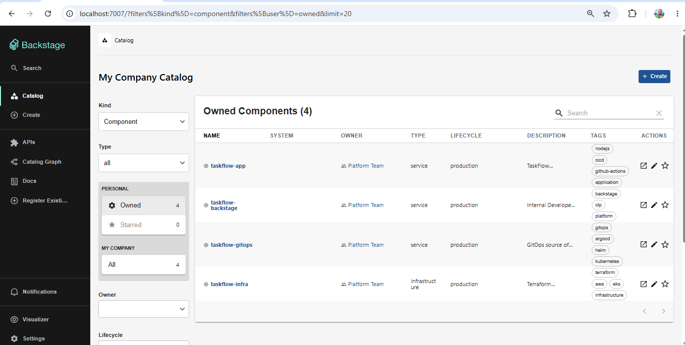
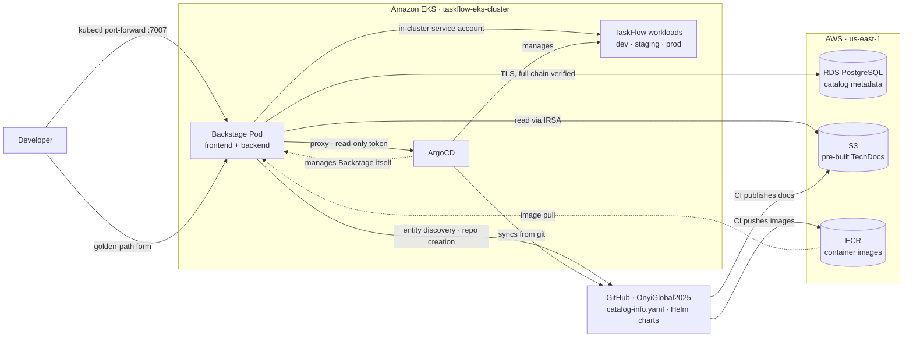
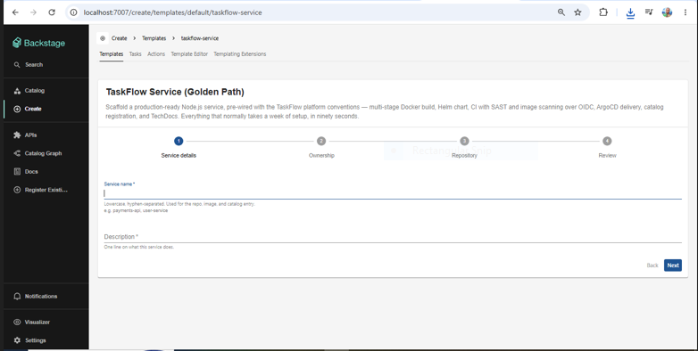
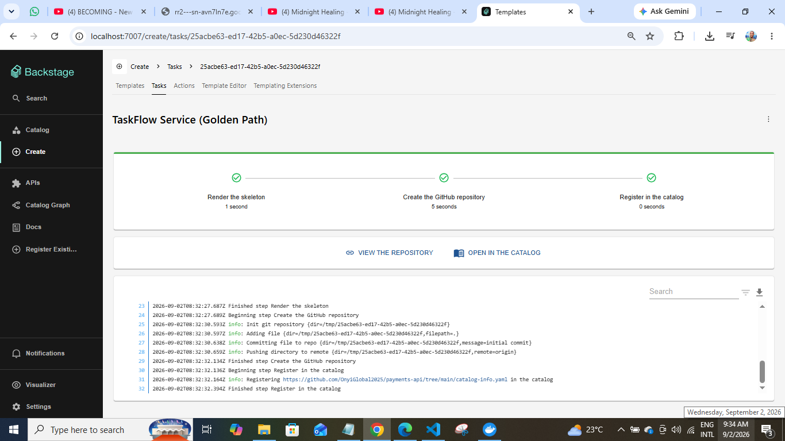
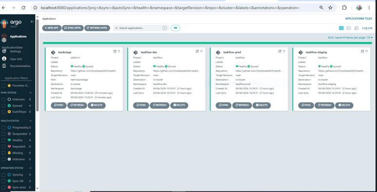

# taskflow-backstage

[](https://backstage.io)
[](https://aws.amazon.com/eks/)
[](https://argo-cd.readthedocs.io/)
[](https://terraform.io)
[](https://aws.amazon.com)


Internal Developer Portal for the **TaskFlow** platform, built on
[Backstage](https://backstage.io), running on Amazon EKS, and delivered by ArgoCD.

A developer fills in a form and gets a GitHub repository with a Dockerfile, a Helm chart,
CI authenticating to AWS over OIDC, ArgoCD delivery config, and documentation rendering in
the portal. Ninety seconds, no tickets.



---

## What this is

TaskFlow is a multi-environment platform on EKS — one Helm chart promoted across dev,
staging, and production through an ArgoCD ApplicationSet, with GitHub Actions CI over OIDC,
Trivy scanning, and OPA policy gates. Solid delivery machinery, spread across four
repositories.

This portal is the front door to it. Not a dashboard — a place where a developer can find a
service, see its live state, read its docs, and create a new one without asking anybody.

**What it provides:**

- **Software catalog** across four repositories, with ownership resolved through a
  `platform-team` group and GitHub OAuth sign-in
- **TechDocs** built in CI with `techdocs-cli`, published to S3, and read by Backstage over
  IRSA — the external builder pattern, so the portal never runs a docs build itself
- **Live Kubernetes status** per service — pods, deployments, and resource usage via
  metrics-server
- **ArgoCD sync and health state** on each service page, through the Backstage proxy with a
  read-only ArgoCD account
- **A golden-path Software Template** that scaffolds a production-wired service repository
  from a form submission
- **Self-delivery** — Backstage runs under ArgoCD management from its own AppProject, so a
  change pushed to its Helm chart reaches the cluster with no manual command

---

## Architecture



| Layer | Technology |
|---|---|
| Portal | Backstage (new frontend system) |
| Runtime | Amazon EKS, spot node group |
| Persistence | Amazon RDS for PostgreSQL 16, private subnet, TLS with full chain verification |
| Image registry | Amazon ECR, commit-SHA tags |
| Docs storage | Amazon S3, read via IRSA |
| Delivery | ArgoCD, `platform` AppProject, automated sync |
| Infrastructure | Terraform (S3 remote state) |
| CI | GitHub Actions with OIDC federation — no long-lived AWS keys |
| Catalog source | GitHub org `OnyiGlobal2025` |

---

## The golden path

The centrepiece. `scaffolder-templates/service/` defines a four-step form — service details,
ownership, repository location, review — that generates a real GitHub repository containing:

- A multi-stage `Dockerfile`
- A Helm chart carrying the platform's conventions
- A GitHub Actions workflow authenticating to AWS over OIDC
- ArgoCD delivery configuration
- `catalog-info.yaml`, so the service appears in the portal immediately
- `mkdocs.yml` and a `docs/` folder, so TechDocs works from the first commit






The template is locked to the `OnyiGlobal2025` org via `allowedOwners`, and registered in
`app-config.production.yaml` with `rules: [allow: [Template]]`.

---

## Access model

**Cluster-internal by design.** No public domain, no ALB, no ACM certificate, no
ExternalDNS.

An internal developer portal has no business on the public internet, and the GitHub OAuth
callback works perfectly against `localhost:7007`. It also means the entire build runs on a
cluster that is destroyed at the end of every session.

```bash
kubectl port-forward svc/backstage 7007:7007 -n backstage
# open http://localhost:7007
```

Adding public ingress later is an afternoon's work — the Helm values carry a commented-out
ingress block for exactly that.

---

## Repository layout

```
taskflow-backstage/
├── packages/
│   ├── app/                      # Backstage frontend (new frontend system)
│   └── backend/                  # Backstage backend + Dockerfile
├── helm/backstage/               # Helm chart — the deployment ArgoCD manages
├── scaffolder-templates/
│   └── service/                  # Golden-path template + skeleton
├── scripts/
│   └── build-and-push.sh         # SHA-tagged image build with a clean-tree guard
├── docs/                         # TechDocs source for this repo
├── app-config.yaml               # Base configuration
├── app-config.production.yaml    # In-cluster configuration (overrides, not merges)
├── catalog-info.yaml             # This repo's own catalog entry
├── catalog-org.yaml              # platform-team Group and User entities
├── mkdocs.yml                    # TechDocs build config
├── Troubleshooting-LOG.md        # Every issue hit during the build, with diagnosis
└── README.md
```

---

## Notable engineering decisions

**TechDocs uses the external builder pattern.** CI builds documentation with `techdocs-cli`
and publishes to S3; Backstage only reads. The portal never runs a docs build, so a
malformed `mkdocs.yml` in any repository cannot affect portal availability.

**RDS connections verify the full certificate chain.** RDS enforces SSL, and Node's default
trust store does not contain the Amazon RDS CA. The obvious fix is
`ssl: { rejectUnauthorized: false }` — which encrypts the connection while skipping
certificate validation, leaving it open to man-in-the-middle attack from inside the VPC.
Instead, the regional RDS CA bundle is mounted from a ConfigMap and referenced via
Backstage's `$file` directive. Roughly ten extra minutes; a defensible answer in a review.

**Images are tagged with commit SHAs, guarded by a clean-tree check.** A SHA tag describes
the last commit, so building with uncommitted changes produces an image whose tag names code
it does not contain. `scripts/build-and-push.sh` refuses to build a dirty working tree, and
runs `yarn tsc && yarn build:backend` before `docker build` — because the backend Dockerfile
packages a pre-built artifact and will silently ship stale code otherwise.

**Backstage is delivered by ArgoCD from its own AppProject.** Not the `taskflow` project —
that one permits a different repository and different namespaces, and widening it would let
the application project deploy into the platform namespace. The `platform` project's
`clusterResourceWhitelist` names only `Namespace`, `ClusterRole`, and `ClusterRoleBinding`:
the whitelist is the project's blast radius, and it should name what the chart actually
creates and nothing more.

**The GitHub Actions trust policy uses an org-scoped wildcard.** Repositories created after
15 July 2026 receive immutable OIDC subject claims embedding numeric org and repo IDs — and
a scaffolded service's repo ID is generated by GitHub at scaffold time, so it cannot be
written into Terraform in advance. Per-repository trust entries do not survive contact with
self-service. The org ID stays pinned. In a multi-team organisation the right answer is a
second, narrower role for scaffolded services; with a single operator, that complexity has
no threat model to justify it.

---



## Troubleshooting log

[`Troubleshooting-LOG.md`](./Troubleshooting-LOG.md) documents every issue hit during this
build — symptom, diagnosis path, what was ruled out, root cause, and fix.

A few worth reading:

- **Issue 23** — a `docker build` that succeeded while shipping stale code, because the
  Backstage backend Dockerfile packages a pre-built `bundle.tar.gz`. YAML changes worked;
  code changes silently did not.
- **Issue 25** — GitHub's immutable subject claims breaking OIDC federation in newly created
  repositories only, while three older repositories kept working.
- **Issue 39** — ArgoCD API tokens are cluster-scoped. A token from a destroyed cluster is
  worthless, and the failure mode looks exactly like a proxy misconfiguration.
- **Issue 46** — a confident diagnosis held for an entire phase, and inverted. The card I
  thought was broken had been working all along; the browser console named the real problem
  in one line.

---

## Running it

The full session-start sequence is in **Issue 42** of the troubleshooting log — several
objects do not survive `terraform destroy` and must be recreated each session, in a
specific order.

Broadly:

```bash
# 1. Infrastructure
cd ../taskflow-infra/terraform
export TF_VAR_backstage_db_password='...'
terraform apply
aws eks update-kubeconfig --name taskflow-eks-cluster --region us-east-1

# 2. Build and push
cd ../../taskflow-backstage
./scripts/build-and-push.sh

# 3. Deploy (bootstrap only — ArgoCD takes over afterwards)
helm upgrade --install backstage ./helm/backstage -n backstage \
  --set image.tag=$(git rev-parse --short HEAD)

# 4. Access
kubectl port-forward svc/backstage 7007:7007 -n backstage
```

**Teardown:** delete any LoadBalancer services first — orphaned ALBs block VPC teardown —
then `terraform destroy`.

---

## Account and region

- AWS account: `713923090919`
- Region: `us-east-1`
- Default branch: `main`

---

## Related repositories

| Repository | Contents |
|---|---|
| [taskflow-infra](https://github.com/OnyiGlobal2025/taskflow-infra) | Terraform — VPC, EKS, RDS, ECR, IAM, OIDC |
| [taskflow-gitops](https://github.com/OnyiGlobal2025/taskflow-gitops) | ArgoCD projects, ApplicationSet, Helm charts, env values |
| [taskflow-app](https://github.com/OnyiGlobal2025/taskflow-app) | The application — Node.js backend and frontend |

---

Built by [Onyedika Okoro](https://linkedin.com/in/onyedika-okoro) — Platform & Cloud
Engineer. Full write-up: https://onyiglobal2025.hashnode.dev/i-built-an-internal-developer-portal-on-eks-three-bugs-taught-me-more-than-the-build-did