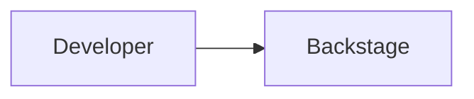

1. Nested repository folders (accidental repo-inside-repo)

Symptom: Created taskflow-backstage and then created the other three repo folders inside it, so taskflow-app/gitops/infra were nested under taskflow-backstage. Pushing would have swallowed all four into one repo.
Cause: VS Code was opened inside a repo folder rather than the parent, so new folders landed one level too deep.
Fix: Moved the three folders out to be siblings; established the rule that the folder opened in VS Code must be the parent that holds all repos, never a repo itself.

2. Documents vs Downloads — placeholder folders were not real repos

Symptom: The taskflow-app/infra/gitops folders in Documents errored not a git repository; the real cloned repos with actual code lived in Downloads/taskflow-eks-platform (Project 1). Risk of pushing empty doc-only folders over real project code.
Cause: Today's doc work was done in fresh Documents folders that were never git clones; the true GitHub-linked clones were elsewhere.
Fix: Located the real repos with a .git search, worked in the real clones under taskflow-eks-platform, deleted the Documents placeholders. One true copy per repo.

3. GitLab remote instead of GitHub (from the outage)

Symptom: git remote -v on the real taskflow-infra showed gitlab.com, not GitHub.
Cause: During an earlier GitHub outage, repos were pushed to GitLab as a temporary parking spot.
Fix: Confirmed GitHub was back and had the full latest code, then git remote set-url origin back to GitHub before pushing docs.

4. Preserving Project 1 READMEs (merge, not overwrite)

Symptom: Risk of the new TechDocs READMEs wiping the existing Project 1 documentation.
Cause: Both the old project README and the new Backstage descriptor wanted the same README.md.
Fix: Merged — kept the original Project 1 README on top, added a divider and an "Internal Developer Portal (Backstage / TechDocs)" section below. Nothing lost.

5. Node version mismatch (v20 vs v22) across shells

Symptom: PowerShell had Node v22.22.1; Git Bash defaulted to v20.19.6. Backstage 1.46+ requires Node 22/24 — scaffolding under v20 would fail partway.
Cause: Two Node installs; Git Bash's .nvm served the older v20 first on PATH.
Fix: nvm install 22 && nvm use 22 && nvm alias default 22. The alias default makes it stick in new terminals. (Note: fresh Git Bash sessions still sometimes need nvm use 22.)

6. Corepack EPERM / Yarn not on PATH

Symptom: corepack enable failed with EPERM: operation not permitted writing to C:\Program Files\nodejs\; later the scaffold failed at yarn install because yarn was "not recognized."
Cause: Corepack needed admin rights to write shims; Yarn wasn't globally available.
Fix: Skipped corepack, installed Yarn globally with npm install --global yarn. The scaffold then pinned its own Yarn 4.x per-project.

7. Scaffold yarn install network failures (DNS / timeout on tethering)

Symptom: getaddrinfo ENOTFOUND registry.yarnpkg.com, then ETIMEDOUT after several minutes. Install died repeatedly.
Cause: Unstable USB tethering dropping during a large (~660 MiB) download.
Fix: Switched registry to the npm mirror (yarn config set npmRegistryServer "https://registry.npmjs.org"), which got further; ultimately completed by re-running (Yarn 4 resumes from where it stopped — no progress lost). Key lesson: the big install is the one bandwidth-heavy step; it always resumes on retry.

8. Missing .yarn/releases after the merge

Symptom: yarn start in the real repo: Cannot find module '...\.yarn\releases\yarn-4.13.0.cjs'.
Cause: The merge deliberately excluded the huge .yarn cache, but that also dropped .yarn/releases/, which holds the pinned Yarn binary the repo needs.
Fix: Copied only .yarn/releases (small — the binary, not the cache) into the real repo. Rule learned: exclude .yarn/cache, but keep and commit .yarn/releases.

9. node_modules not portable — needed a fresh install

Symptom: yarn start failed with Couldn't find the node_modules state file.
Cause: The merge (correctly) excluded node_modules; native modules (better-sqlite3, esbuild, isolated-vm) are built for their exact path and aren't safe to copy.
Fix: Ran yarn install in the real repo location. Lesson: node_modules is disposable and regenerated per location with yarn install, never copied.

10. Kubernetes plugin crash → empty catalog (the big one)

Symptom: Backend threw Plugin 'kubernetes' threw an error during startup … Failed to instantiate service 'core.auth' for 'kubernetes' … IPC request 'DevDataStore.load' timed out, which shut down the whole process and left the catalog at 0 components.
Cause: The scaffolded kubernetes backend plugin fails to initialize in local dev with no cluster wired up, and its crash cascades to catalog ingestion.
Fix: Commented out backend.add(import('@backstage/plugin-kubernetes-backend')); in packages/backend/src/index.ts. Backend then started clean and the catalog populated. To be re-enabled and configured when Kubernetes integration is built.

11. TechDocs build failed — required Docker

Symptom: TechDocs tab: Failed to generate docs … This operation requires Docker. Docker does not appear to be available. plus a 404.
Cause: Scaffold defaults TechDocs generator to runIn: 'docker'; no Docker running.
Fix: Installed local mkdocs tooling (pip install mkdocs-techdocs-core, gives mkdocs 1.6.1 + techdocs-core 1.7.0) and set techdocs.generator.runIn: 'local' in app-config.yaml. Docs then built directly via local mkdocs, no Docker.

12. platform-team group not found — the stubborn one

Symptom: Every component showed owner platform-team, but the group didn't exist in the catalog; each entity showed the orange warning Entities not found are: group:default/platform-team. The catalog-org.yaml file existed, was pushed, was valid YAML, and its location was registered — yet it never ingested, with no error in the logs.
Cause: The catalog-org.yaml location was added without a rule permitting Group/User kinds, so Backstage's catalog rules silently rejected the entities — no crash, no log, just skipped.
Fix: Added rules: - allow: [User, Group] to that location entry in app-config.yaml. The Platform Team group loaded immediately and every component's ownership resolved. (Also switched the org file from a blob URL to a local - type: file path during debugging.)

13. Scaffold placeholder descriptor (john@example.com)

Symptom: An entity taskflow-backstage-app appeared with owner john@example.com, type website.
Cause: The scaffold's generated catalog-info.yaml had placeholder metadata; we hadn't rewritten it.
Fix: Replaced it with a proper descriptor — name taskflow-backstage, owner platform-team, correct type, plus the techdocs-ref annotation. The orphaned old entity resolved on refresh.

14. Backend startup cascade — DevDataStore IPC timeout (local dev only)

Symptom: On some yarn start runs the backend failed with BackendStartupError — several plugins at once (search, user-settings, notifications, signals, mcp-actions) all failing on DevDataStore.load … timed out. The frontend then loaded but showed "Failed to load entity types" with a stalled, spinning catalog.
Cause: DevDataStore is the dev CLI↔backend IPC channel used to restore SQLite state between restarts. On a resource-constrained machine the restore stalls, and every plugin waiting on it times out together — not a single-plugin fault. There is no app-config timeout setting for this.
Fix: Local-dev mitigation, not a code fix. Start with localhost browser tabs closed to free memory; if the cascade appears, clear the dev SQLite cache and restart: rm -f packages/backend/*.sqlite && yarn start. This issue is local-dev-only — it disappears entirely under the Phase 3 in-cluster deployment (real Postgres, no dev-CLI IPC), so it is mitigated by design rather than code-fixed.


15. TechDocs mermaid — raw code, then rendered

Symptom: Architecture diagrams showed as raw ```mermaid code blocks, not diagrams.
Cause: Rendering requires the frontend addon; it was deliberately deferred from Phase 0. The mkdocs.yml files were pre-wired with the pymdownx.superfences mermaid fence back in Phase 0.
Fix: Installed backstage-plugin-techdocs-addon-mermaid (yarn --cwd packages/app add ...) and wired it into the new frontend system in App.tsx — adding techDocsPlugin from @backstage/plugin-techdocs/alpha and techDocsMermaidAddonModule, both in the createApp features array. Diagrams then rendered in the browser.

16. Mermaid edge label truncated

Symptom: A diagram edge label showed "namespaces via kubectl pos" — cut off.
Cause: The <br/> line break inside a mermaid edge label doesn't render; the long label overflowed.
Fix: Shortened the label to kubectl post-apply in architecture.md.

A few cross-cutting lessons worth stating in the README (they tie the incidents together and read as real operational judgment):

The recurring DevDataStore.load timed out signature (issues 10, 14) is one underlying flakiness surfacing on different plugins — diagnosing it as one root cause rather than many is the real insight.
The catalog allow rule (issue 12) is the classic "silent rejection, no error log" trap — the fix was found by reasoning about catalog rules, not from any error message.
node_modules and .yarn/cache are disposable/regenerated; .yarn/releases must be kept (issues 8, 9).
The whole Documents/Downloads/GitLab tangle (2, 3) is a lesson in verifying git remote -v and .git presence before acting, never assuming a folder is the repo you think it is.

## Issue 17: Backstage pod CrashLoopBackOff — RDS hostname NXDOMAIN

**Phase:** Project 5, Phase 3 (Backstage deployment to EKS)
**Date:** 2026-08-30

### Symptom

After `helm install backstage`, the pod reached `Running` but never became ready (`0/1`), and restart count climbed steadily (2 restarts in ~5 minutes). The liveness probe was killing the container on a loop.

`kubectl logs -n backstage -l app=backstage --previous --tail=80` showed:

```
Failed to connect to the database to make sure that 'backstage_plugin_app' exists,
Error: getaddrinfo ENOTFOUND taskflow-backstage.ce54ui0w20lkx.us-east-1.rds.amazonaws.com
```

### Investigation

The key signal was **`ENOTFOUND`, not `ECONNREFUSED` or `ETIMEDOUT`**. That distinguishes DNS resolution failure from connectivity failure — the pod never turned the hostname into an IP, so it never reached the network layer at all. This ruled out security groups, routing, and the database itself before any of them were checked.

Ruled out in order:

**1. RDS security group** — inbound TCP 5432 open to `10.0.0.0/16` (whole VPC). Nodes at `10.0.0.x` / `10.0.4.x` were covered. Not the cause.

```bash
SG=$(aws rds describe-db-instances --db-instance-identifier taskflow-backstage \
  --region us-east-1 \
  --query 'DBInstances[0].VpcSecurityGroups[0].VpcSecurityGroupId' --output text)
aws ec2 describe-security-groups --group-ids $SG --region us-east-1 \
  --query 'SecurityGroups[0].IpPermissions' --output json
```

**2. VPC DNS attributes** — private RDS endpoints only resolve when both are enabled. Both returned `true`.

```bash
VPC=$(aws eks describe-cluster --name taskflow-eks-cluster --region us-east-1 \
  --query 'cluster.resourcesVpcConfig.vpcId' --output text)
aws ec2 describe-vpc-attribute --vpc-id $VPC --attribute enableDnsSupport \
  --region us-east-1 --query 'EnableDnsSupport.Value'
aws ec2 describe-vpc-attribute --vpc-id $VPC --attribute enableDnsHostnames \
  --region us-east-1 --query 'EnableDnsHostnames.Value'
```

**3. VPC mismatch** — RDS could have landed in the default VPC instead of the cluster's. It had not; both were `vpc-0c35d01802c2b2f00`, subnet group `taskflow-backstage-db-subnet-group`, `PubliclyAccessible: False`.

```bash
aws rds describe-db-instances --db-instance-identifier taskflow-backstage \
  --region us-east-1 \
  --query 'DBInstances[0].[DBSubnetGroup.VpcId,PubliclyAccessible,DBSubnetGroup.DBSubnetGroupName]' \
  --output text
```

**4. CoreDNS health** — tested resolution from inside the cluster network.

```bash
kubectl run dnstest --rm -it --restart=Never --image=busybox:1.36 \
  -n backstage -- nslookup taskflow-backstage.ce54ui0w20lkx.us-east-1.rds.amazonaws.com
```

CoreDNS **answered** from `172.20.0.10` with a definitive `NXDOMAIN` rather than timing out. A timeout would have meant broken CoreDNS; an authoritative "this name does not exist" meant CoreDNS was healthy and the *name* was wrong.

That narrowed the problem to the hostname string itself.

### Root cause

The RDS endpoint had been read off a terminal table and transcribed by hand into `values.yaml`, picking up one extra character:

```
Used:   taskflow-backstage.ce54ui0w20lkx.us-east-1.rds.amazonaws.com
Actual: taskflow-backstage.ce54ui0w20kx.us-east-1.rds.amazonaws.com
                                     ^ spurious "l"
```

Every layer of infrastructure was correctly configured. The hostname simply did not exist.

### Fix

Verified the true endpoint byte-for-byte:

```bash
aws rds describe-db-instances --db-instance-identifier taskflow-backstage \
  --region us-east-1 --query 'DBInstances[0].Endpoint.Address' \
  --output text | cat -A
```

`cat -A` renders every character explicitly and marks end-of-line with `$`, exposing both the real string and any trailing whitespace. (The `^M$` shown is Windows CRLF from Git Bash, not part of the hostname.)

Corrected `postgres.host` in `helm/backstage/values.yaml`, then:

```bash
helm upgrade backstage . --namespace backstage
kubectl rollout status deployment/backstage -n backstage --timeout=300s
```

### Prevention

`rds.tf` declared **no output for the endpoint** — which is why the value was transcribed by eye instead of copied programmatically. Adding an output removes the entire class of error:

```hcl
output "rds_endpoint" {
  description = "RDS PostgreSQL endpoint hostname for Backstage"
  value       = aws_db_instance.backstage.address
}
```

The endpoint can then be piped straight into the Helm values with no human in the loop:

```bash
helm upgrade backstage . --namespace backstage \
  --set postgres.host=$(terraform -chdir=../../../taskflow-infra/terraform output -raw rds_endpoint)
```

### Lessons

- **Read the error class, not just the error.** `ENOTFOUND` = DNS, `ECONNREFUSED` = reached the host but nothing listening, `ETIMEDOUT` = blocked in transit. Each points at a different layer and eliminates the others.
- **`NXDOMAIN` vs timeout is the same distinction one level down.** An answering resolver returning "no such name" exonerates DNS infrastructure and indicts the query.
- **Any value transcribed by hand is a defect waiting to happen.** If Terraform created a resource, Terraform should output its identifiers.
- Probe tuning was correct and not implicated — readiness at 30s and liveness at 90s gave the migration window room. The pod was failing for a real reason.

## Issue 18: RDS rejected unencrypted connections

**Phase:** Project 5, Phase 3 (Backstage deployment to EKS)
**Date:** 2026-08-30

### Symptom

After fixing the hostname (Issue 17), the pod still crash-looped. Logs showed:

```
Failed to connect to the database to make sure that 'backstage_plugin_signals' exists,
error: no pg_hba.conf entry for host "10.0.1.146", user "backstage_admin",
database "postgres", no encryption
```

### Investigation

This is a *better* error than the previous one. DNS resolved, TCP connected, and PostgreSQL itself answered — it rejected the connection at the authentication stage. The operative phrase is `no encryption`: RDS PostgreSQL requires SSL by default, and the client connected in plaintext.

### First attempt (rejected)

The quick fix is `PGSSLMODE=require` as a container env var. This did not work, because the Backstage `pg` client reads its SSL configuration from `app-config.production.yaml`, which overrides the environment variable.

The next quick fix would have been:

```yaml
ssl:
  rejectUnauthorized: false
```

**This was deliberately rejected.** It encrypts the connection but skips certificate chain validation, leaving the connection open to man-in-the-middle attack from inside the VPC. It is also the kind of line a reviewer greps for, and it cannot be defended in an interview. "Cluster-internal" does not justify unverified TLS.

### Root cause

RDS PostgreSQL enforces SSL. Node's default trust store does not contain the Amazon RDS certificate authority, so once SSL was negotiated the connection failed a second time with `self-signed certificate in certificate chain`.

### Fix (production-grade)

Mount the AWS RDS regional CA bundle into the pod and point Backstage at it, so Node performs full chain verification.

```bash
curl -o rds-ca-us-east-1.pem \
  https://truststore.pki.rds.amazonaws.com/us-east-1/us-east-1-bundle.pem
head -1 rds-ca-us-east-1.pem   # must print -----BEGIN CERTIFICATE-----

kubectl create configmap rds-ca-bundle \
  --namespace backstage \
  --from-file=rds-ca-us-east-1.pem
```

`app-config.production.yaml`:

```yaml
database:
  client: pg
  connection:
    host: ${POSTGRES_HOST}
    port: ${POSTGRES_PORT}
    user: ${POSTGRES_USER}
    password: ${POSTGRES_PASSWORD}
    ssl:
      ca:
        $file: /etc/ssl/rds/rds-ca-us-east-1.pem
```

`$file` is Backstage's built-in file-substitution directive — it reads the PEM from the mounted path at startup.

Helm chart additions (`values.yaml`):

```yaml
rdsCa:
  configMapName: rds-ca-bundle
  fileName: rds-ca-us-east-1.pem
  mountPath: /etc/ssl/rds
```

`templates/deployment.yaml`:

```yaml
      volumes:
        - name: rds-ca
          configMap:
            name: {{ .Values.rdsCa.configMapName }}
# ...
          volumeMounts:
            - name: rds-ca
              mountPath: {{ .Values.rdsCa.mountPath }}
              readOnly: true
```

### Design decisions

**ConfigMap rather than baking the PEM into the image.** The CA bundle rotates on Amazon's schedule, independent of application code. Mounting it means a CA rotation is a ConfigMap update and a pod restart — not an image rebuild and redeploy. Same separation-of-concerns reasoning as not baking credentials into images.

**Regional bundle (`us-east-1-bundle.pem`) rather than `global-bundle.pem`.** Contains only the CAs for the region actually being connected to. A smaller trust surface is the correct default.

### Lessons

- `no encryption` in a `pg_hba.conf` error means the server required SSL and the client didn't offer it — an authentication-stage rejection, not a network problem.
- Configuration files can override environment variables. `PGSSLMODE` had no effect because `app-config.production.yaml` set SSL config explicitly.
- **Encryption is not authentication.** `rejectUnauthorized: false` gives the first without the second. Mounting the CA gives both, for roughly ten extra minutes of work.

---

## Issue 19: Kubernetes Secret created with empty values

**Phase:** Project 5, Phase 3
**Date:** 2026-08-30

### Symptom

With TLS working, the pod still crash-looped. New error:

```
SASL: SCRAM-SERVER-FIRST-MESSAGE: client password must be a string
```

### Investigation

The error means the password reached the driver as `undefined` or empty, not that it was wrong. Checked what the container actually received:

```bash
POD=$(kubectl get pods -n backstage -o jsonpath='{.items[0].metadata.name}')
kubectl exec -n backstage $POD -- sh -c \
  'echo "HOST=[$POSTGRES_HOST] USER=[$POSTGRES_USER] PASS_LEN=[${#POSTGRES_PASSWORD}]"'
```

Output: `HOST=[...] USER=[backstage_admin] PASS_LEN=[0]`

Printing the length rather than the value keeps credentials off the screen while still being diagnostic.

Verified the Helm template was correct — both `secretKeyRef` blocks were present and well-formed. So the template was fine and the secret itself was suspect:

```bash
kubectl get secret backstage-secrets -n backstage \
  -o jsonpath='{.data.POSTGRES_PASSWORD}' | base64 -d | wc -c   # → 0
kubectl get secret backstage-secrets -n backstage \
  -o jsonpath='{.data.GITHUB_TOKEN}' | base64 -d | wc -c        # → 0
```

Both keys existed with **zero-length values**.

### Root cause

The secret was originally created using `read -s` to capture values interactively:

```bash
read -s -p "GitHub PAT: " GH_PAT && echo
read -s -p "DB password: " DB_PASS && echo
kubectl create secret generic backstage-secrets \
  --namespace backstage \
  --from-literal=GITHUB_TOKEN="$GH_PAT" \
  --from-literal=POSTGRES_PASSWORD="$DB_PASS"
```

`read -s` never captured the input — the prompts displayed, but the variables stayed empty. `kubectl` dutifully created two keys with empty strings.

**Critically, `kubectl get secret` showed `DATA 2`, which looked correct.** `DATA` counts *keys*, not content. The secret appeared healthy for two hours.

### Fix

```bash
kubectl delete secret backstage-secrets -n backstage

kubectl create secret generic backstage-secrets \
  --namespace backstage \
  --from-literal=GITHUB_TOKEN='<value>' \
  --from-literal=POSTGRES_PASSWORD='<value>'
```

Verified before redeploying — GITHUB_TOKEN 40 chars (correct for a classic PAT), POSTGRES_PASSWORD 11 chars (matching the value used for `TF_VAR_backstage_db_password`).

Single quotes prevent Bash from interpreting `$`, `!`, or backticks in the password. Trade-off: values land in `~/.bash_history`; clear with `history -c` if that matters.

### Lessons

- **`DATA 2` proves keys exist, not that they contain anything.** Always verify secret contents:
  ```bash
  kubectl get secret <name> -n <ns> -o jsonpath='{.data.<KEY>}' | base64 -d | wc -c
  ```
- `read -s` fails silently. Any input method with no feedback needs verification immediately after.
- Verify at the boundary the application sees. `PASS_LEN=[0]` from inside the container was the decisive measurement — it proved the problem was upstream of the app, and the length-only output kept it safe to run.

---

## Issue 20: Liveness/readiness probes 404 on `/healthcheck`

**Phase:** Project 5, Phase 3
**Date:** 2026-08-30

### Symptom

Pods restarted roughly every 150 seconds. Application logs showed the backend starting normally, then:

```json
{"method":"GET","status":404,"url":"/healthcheck","userAgent":"kube-probe/1.36"}
```

repeating until the container was killed.

### Root cause

The Helm chart's probes were configured against `/healthcheck`, which current Backstage versions no longer serve. The endpoints moved to:

- `/.backstage/health/v1/readiness`
- `/.backstage/health/v1/liveness`

Every probe returned 404, the liveness probe hit its failure threshold, and Kubernetes killed a perfectly healthy container. **The application was never broken.**

### Investigation note — no shell tools in the image

The obvious check (`kubectl exec ... wget`) failed:

```
exec: "wget": executable file not found in $PATH
```

`node:22-trixie-slim` ships Node but no `wget` or `curl`. Used Node's built-in http module instead:

```bash
POD=$(kubectl get pods -n backstage -o jsonpath='{.items[0].metadata.name}')
kubectl exec -n backstage $POD -- node -e \
  "require('http').get('http://localhost:7007/.backstage/health/v1/readiness',\
r=>{console.log('STATUS',r.statusCode);r.on('data',d=>process.stdout.write(d))})"
```

Output: `STATUS 200 {"status":"ok"}` — path confirmed, and simultaneously proved the backend was serving correctly the whole time.

### Fix

`values.yaml`:

```yaml
probes:
  readinessPath: /.backstage/health/v1/readiness
  livenessPath: /.backstage/health/v1/liveness
```

`templates/deployment.yaml`:

```yaml
          readinessProbe:
            httpGet:
              path: {{ .Values.probes.readinessPath }}
              port: http
            initialDelaySeconds: 30
            periodSeconds: 10
            failureThreshold: 6
          livenessProbe:
            httpGet:
              path: {{ .Values.probes.livenessPath }}
              port: http
            initialDelaySeconds: 90
            periodSeconds: 20
            failureThreshold: 3
```

No image rebuild required — probe paths are chart configuration, not application code.

### Design decisions

**Separate readiness and liveness paths.** Readiness reports whether the app can serve traffic; liveness reports whether the process is stuck. Pointing liveness at the readiness endpoint would restart the pod whenever a dependency blipped, rather than only when the process was genuinely wedged.

**Probe timing.** Readiness at `initialDelaySeconds: 30` with `failureThreshold: 6` gives Backstage room to run database migrations on first boot. Liveness at 90s starts well after readiness, so it can never fire during that migration window.

### Lessons

- A crash-looping pod is not necessarily a broken application. Check whether the *probe* is the thing failing before debugging the app.
- Slim base images lack standard debugging tools. Know what the image *does* have — Node, in this case — and use it.
- Health endpoint paths change between framework versions. Verify against the running application rather than assuming.

---

## Issue 21: Dockerfile not at repository root

**Phase:** Project 5, Phase 3
**Date:** 2026-08-30

### Symptom

```
ERROR: failed to build: failed to solve: failed to read dockerfile:
open Dockerfile: no such file or directory
```

(Preceded by a separate failure — `error during connect: ... dockerDesktopLinuxEngine` — because Docker Desktop wasn't running. Started it and retried.)

### Root cause

The Backstage `create-app` scaffold places the backend Dockerfile at `packages/backend/Dockerfile`, not the repository root. `docker build ... .` assumes a root Dockerfile.

### Fix

```bash
docker build -f packages/backend/Dockerfile \
  -t 713923090919.dkr.ecr.us-east-1.amazonaws.com/taskflow-backstage:latest .
```

`-f` sets the Dockerfile path; the trailing `.` keeps the build context at the repository root.

### Why the context must stay at root

Backstage is a Yarn workspaces monorepo. The build needs `package.json`, `yarn.lock`, and `app-config.production.yaml` from the repo root. Running `docker build` from inside `packages/backend/` would scope the context to that directory and the build would fail — or worse, succeed while silently omitting the production config.

The Dockerfile's `CMD` confirms both configs are loaded at runtime:

```dockerfile
CMD ["node", "packages/backend", "--config", "app-config.yaml", "--config", "app-config.production.yaml"]
```

### Lessons

- Dockerfile location and build context are independent. `-f` sets one, the positional argument sets the other.
- In a monorepo, the context is almost always the repository root regardless of where the Dockerfile sits.

---

## Issue 22: Catalog API 401s and missing entities in the deployed portal

**Phase:** Project 5, Phase 3
**Date:** 2026-08-30

### Symptom (part 1) — 401 Unauthorized

The portal loaded from the cluster, but the catalog page showed `Error: Could not fetch catalog entities` and `Failed to load entity types`. Backend logs:

```json
{"method":"GET","status":401,"url":"/api/catalog/entities/by-query?..."}
{"method":"GET","status":200,"url":"/.backstage/health/v1/liveness"}
```

Probes returned 200 while every `/api/catalog/*` request returned 401 — the backend was healthy but rejecting unauthenticated API calls.

### Root cause (part 1)

`app-config.production.yaml` declared `auth.providers.guest: {}`, but current Backstage refuses guest authentication outside development unless explicitly opted into.

### Fix (part 1)

```yaml
auth:
  providers:
    guest:
      dangerouslyAllowOutsideDevelopment: true
```

**Security note, stated honestly:** guest auth grants full access with no identity. This is acceptable for a cluster-internal, port-forward-only portfolio IDP with no public ingress, no domain, and no real data. A production deployment would wire GitHub OAuth or OIDC instead. The flag is named `dangerously...` deliberately, and the reasoning belongs in the README rather than being quietly enabled.

### Symptom (part 2) — wrong entities

With auth fixed, the catalog rendered — showing exactly one component: `example-website`, from the scaffold's demo data. None of the four real repositories appeared.

### Root cause (part 2)

`app-config.production.yaml` **overrides** the catalog locations from `app-config.yaml`. The Phase 2 registrations lived in `app-config.yaml` and were being discarded. The production config still listed only the scaffold's local example files:

```yaml
- type: file
  target: ./examples/entities.yaml
```

`type: file` cannot work in a deployed pod — those paths refer to the local filesystem.

### Fix (part 2)

```yaml
catalog:
  locations:
    - type: url
      target: https://github.com/OnyiGlobal2025/taskflow-app/blob/main/catalog-info.yaml
    - type: url
      target: https://github.com/OnyiGlobal2025/taskflow-backstage/blob/main/catalog-info.yaml
    - type: url
      target: https://github.com/OnyiGlobal2025/taskflow-gitops/blob/main/catalog-info.yaml
    - type: url
      target: https://github.com/OnyiGlobal2025/taskflow-infra/blob/main/catalog-info.yaml
    - type: url
      target: https://github.com/OnyiGlobal2025/taskflow-backstage/blob/main/catalog-org.yaml
      rules:
        - allow: [User, Group]
```

`type: url` fetches over HTTPS using the PAT in `GITHUB_TOKEN` — which is the reason that secret exists. The `rules` block on the org location is required for `User` and `Group` entities (same constraint hit in Phase 2).

### Sub-incident — duplicate `locations:` key

On first edit, the new block was inserted while the old one remained, producing two `locations:` keys under a single `catalog:`. YAML accepts this silently and the last key wins, so the rebuild would have changed nothing. Caught before building:

```bash
grep -c "locations:" app-config.production.yaml   # must be exactly 1
tail -3 app-config.production.yaml                # must end on the allow line
```

A second near-miss: the file was edited but **unsaved** (filled dot on the VS Code tab). Docker builds from disk, not from the editor buffer. Verifying from the terminal rather than the editor catches both classes of error.

### Result

All four components appeared, owned by `platform-team`, with tags and descriptions intact — served from EKS, backed by RDS over fully verified TLS, catalog ingested from GitHub via the PAT.

### Lessons

- **Read the status codes together.** Probes at 200 and API at 401 localised the fault to authentication instantly; both failing would have meant something else entirely.
- Backstage config files override rather than merge for list values. Anything set in `app-config.yaml` must be repeated in `app-config.production.yaml` if it's still needed.
- `type: file` catalog locations are development-only. Deployed instances need `type: url`.
- **Verify from the terminal, not the editor.** Unsaved buffers and duplicate YAML keys both fail silently and both cost a full rebuild cycle.

---

## Session note: transient failures that were not bugs

Two failures during this session looked alarming but were environmental:

**`kubectl` lost DNS to the EKS control plane mid-rollout.**

```
dial tcp: lookup A893C...gr7.us-east-1.eks.amazonaws.com: no such host
```

This was the *local machine* failing to resolve the cluster endpoint (USB tethering instability), not a cluster fault. `kubectl rollout status` failing does not mean the rollout failed — it means the watch was interrupted. Confirm actual state with `kubectl get pods` before concluding anything.

**Docker Desktop not running**, producing `error during connect: ... dockerDesktopLinuxEngine`. Started it and retried.

Neither is worth a full entry, but both are worth recognising quickly rather than debugging as if they were application problems.

## Issue 23: GitHub OAuth sign-in — stale Docker bundle masked three separate faults

**Phase:** Project 5, Phase 4 (GitHub Auth & Software Catalog)
**Date:** 2026-08-30

### Symptom

After replacing guest auth with GitHub OAuth in `app-config.yaml`, the portal loaded straight into the catalog with no sign-in page at all, and every catalog request returned 401:

```json
{"method":"GET","status":401,"url":"/api/catalog/entities/by-query?..."}
{"method":"GET","status":200,"url":"/.backstage/health/v1/liveness"}
```

Probes returned 200 while the API returned 401 — the backend was healthy and rejecting unauthenticated calls. The frontend had never authenticated because it presented no way to do so.

### The root cause that hid everything else

**Backstage's backend Dockerfile does not build the application.** It packages a pre-built artifact:

```dockerfile
# yarn install --immutable
# yarn tsc
# yarn build:backend
# Once the commands have been run, you can build the image using `yarn build-image`
...
COPY --chown=node:node packages/backend/dist/bundle.tar.gz app-config*.yaml ./
RUN tar xzf bundle.tar.gz && rm bundle.tar.gz
```

The instructions are in comments at the top of the file. Without running `yarn build:backend` first, `docker build` succeeds and produces a valid image — containing whatever `bundle.tar.gz` was last generated.

This produced a deeply misleading failure pattern:

- **YAML config changes worked**, because `app-config*.yaml` is copied separately on the same line, outside the bundle.
- **Code changes silently did not**, because `App.tsx` compiles into `bundle.tar.gz`.

Every earlier fix in Phase 3 — SSL, probe paths, catalog locations — was YAML, so everything appeared to be working normally. The first code change of the project was the sign-in page, and it vanished without a trace. `docker build` reported success, `docker push` reported a new digest (the config layers had genuinely changed), and the pod restarted cleanly. Nothing in the tooling indicated a problem.

### How it was finally caught

Instead of trusting the build, grep the running container for a string that only exists in the new code:

```bash
POD=$(kubectl get pods -n backstage -o jsonpath='{.items[0].metadata.name}')
kubectl exec -n backstage $POD -- sh -c \
  "grep -rl 'Sign in using GitHub' . --include=*.js 2>/dev/null | head -3"
```

Empty result → the code is not in the image, regardless of what the build output said.

After `yarn build:backend` and a rebuild, the same command returned:

```
./packages/app/dist/static/main.91cd6a1938f1.js
```

### Correct build sequence

```bash
cd taskflow-backstage
nvm use 22
yarn install --immutable      # only when dependencies changed
yarn tsc
yarn build:backend            # regenerates packages/backend/dist/bundle.tar.gz
docker build -f packages/backend/Dockerfile -t <ecr-url>:latest .
docker push <ecr-url>:latest
kubectl rollout restart deployment/backstage -n backstage
```

**Rule of thumb:** config-only change → Docker build alone is sufficient. Any change under `packages/*/src/` → `yarn build:backend` first, without exception.

---

### The three real faults, once the build was fixed

The stale bundle meant fixes were applied and then discarded, which made it impossible to tell a wrong fix from an undelivered one. Three genuine faults existed, found in this order:

#### Fault 1 — sign-in page is a code extension, not YAML config

In the new frontend system, `app.auth.providers` in `app-config.yaml` does **not** produce a sign-in page. The `signInPage` input on the `app/root` extension is marked `internal: true` in the type definitions, meaning it can only be attached from code:

```typescript
signInPage: ExtensionInput<ConfigurableExtensionDataRef<
  ComponentType<SignInPageProps>>, "core.sign-in-page.component", {}>, {
    singleton: true;
    optional: true;
    internal: true;
  }
```

Two attempts to enable it via `app-config.yaml` (`app.auth.providers.github: {}` and an `extensions: - sign-in-page:app` entry) were both wrong. The correct approach is `SignInPageBlueprint` in `packages/app/src/App.tsx`:

```tsx
import { githubAuthApiRef } from '@backstage/core-plugin-api';
import { SignInPageBlueprint } from '@backstage/plugin-app-react';
import { SignInPage } from '@backstage/core-components';
import { createFrontendModule } from '@backstage/frontend-plugin-api';

const signInPage = SignInPageBlueprint.make({
  params: {
    loader: async () => props => (
      <SignInPage
        {...props}
        provider={{
          id: 'github-auth-provider',
          title: 'GitHub',
          message: 'Sign in using GitHub',
          apiRef: githubAuthApiRef,
        }}
      />
    ),
  },
});

export default createApp({
  features: [
    catalogPlugin,
    techDocsPlugin,
    techDocsMermaidAddonModule,
    navModule,
    createFrontendModule({
      pluginId: 'app',
      extensions: [signInPage],
    }),
  ],
});
```

#### Fault 2 — browser served a stale JS bundle

Once the sign-in page deployed, Chrome continued rendering the cached catalog page with 401 errors. Opening the same URL in a different browser immediately showed a sign-in page — proving the deployment was fine and the browser was not.

Frontend assets are bundled into the image and served from a fixed origin (`localhost:7007`), so an aggressive cache can survive many redeploys. **When debugging a frontend change, verify in a browser that has never loaded the app**, or hard-reload with `Ctrl+Shift+R` and DevTools → Network → Disable cache.

#### Fault 3 — backend auth provider module never registered

With a working sign-in page, clicking SIGN IN returned:

```json
{"error":{"name":"NotFoundError","message":"Unknown auth provider 'github'"},
 "response":{"statusCode":404}}
```

`@backstage/plugin-auth-backend-module-github-provider` was present in `packages/backend/package.json` — but installing a package does not register it. `packages/backend/src/index.ts` still registered only the guest provider:

```typescript
backend.add(import('@backstage/plugin-auth-backend'));
backend.add(import('@backstage/plugin-auth-backend-module-guest-provider'));
```

Fix — replace the guest module with the GitHub one:

```typescript
backend.add(import('@backstage/plugin-auth-backend-module-github-provider'));
```

---

### Full working configuration

**GitHub OAuth App** (github.com/settings/developers):
- Homepage URL: `http://localhost:7007`
- Redirect URI: `http://localhost:7007/api/auth/github/handler/frame` — must match exactly; GitHub rejects any variation, including a trailing slash
- Device Flow: disabled (not used by the browser redirect flow)

Note: GitHub's UI now labels this field **Redirect URI**, not "Authorization callback URL" as most documentation still says.

**`app-config.yaml`:**

```yaml
auth:
  environment: production
  providers:
    github:
      production:
        clientId: ${AUTH_GITHUB_CLIENT_ID}
        clientSecret: ${AUTH_GITHUB_CLIENT_SECRET}
        signIn:
          resolvers:
            - resolver: usernameMatchingUserEntityName
```

`environment: production` selects which nested provider block is read; the nested key must match it.

**Identity resolution.** `usernameMatchingUserEntityName` maps the GitHub login onto a `User` entity of the same name. The catalog's User entity was `onyedika` while the actual GitHub login is `OnyiGlobal2025` — a mismatch that would have failed sign-in with "unable to resolve user identity". Fixed by renaming the entity in `catalog-org.yaml` rather than swapping to a looser resolver, which keeps the catalog accurate about who owns what:

```yaml
apiVersion: backstage.io/v1alpha1
kind: User
metadata:
  name: OnyiGlobal2025
spec:
  memberOf:
    - platform-team
```

**Kubernetes secret** — two new keys alongside the existing PAT and DB password:

```bash
kubectl create secret generic backstage-secrets \
  --namespace backstage \
  --from-literal=GITHUB_TOKEN='<pat>' \
  --from-literal=POSTGRES_PASSWORD='<password>' \
  --from-literal=AUTH_GITHUB_CLIENT_ID='<client-id>' \
  --from-literal=AUTH_GITHUB_CLIENT_SECRET='<client-secret>'
```

Verified with the Issue 19 length check across all four keys before deploying — 40, 11, 20, 40.

**Helm Deployment** — two additional `secretKeyRef` entries for `AUTH_GITHUB_CLIENT_ID` and `AUTH_GITHUB_CLIENT_SECRET`, matching the `${...}` placeholders in `app-config.yaml`.

### Result

Sign-in page renders a GitHub card → SIGN IN opens GitHub's OAuth flow ("to continue to TaskFlow Backstage") → after authorising, the catalog loads showing **Owned Components (4)**.

That "Owned" count is the meaningful verification. It only resolves if the full chain works: GitHub identity → `OnyiGlobal2025` User entity → `platform-team` membership → ownership of all four components. A plain catalog listing would prove sign-in; the Owned filter proves identity resolution.

---

### Security note — credential exposure during this session

A screenshot shared during debugging showed `app-config.local.yaml` open in the editor with the GitHub PAT in plaintext. The file is git-ignored and the token never reached GitHub, but it was visible in the image. The token was revoked at github.com/settings/tokens, a replacement generated, and the Kubernetes secret recreated.

**Practice going forward:** close or crop files containing credentials before screenshotting. Git-ignoring a file protects the repository, not the screen.

---

### Lessons

- **A successful `docker build` does not mean your code is in the image.** When the Dockerfile packages a pre-built artifact, the build can succeed while shipping stale code, with no warning anywhere in the output. Read the Dockerfile before trusting the build.
- **Verify deployment by inspecting the artifact, not the tooling.** `grep` for a known-new string inside the running container. This single check would have saved several rebuild cycles.
- **When a fix "doesn't work" repeatedly, question the delivery mechanism before the fix.** Three plausible fixes appeared to fail in a row; none of them were ever actually deployed. The pattern of *everything* failing is itself evidence that the changes aren't arriving.
- **Config-vs-code is the axis that mattered here.** Understanding that `app-config*.yaml` is copied outside the bundle explains precisely why Phase 3's fixes all worked and Phase 4's first fix did not.
- **Read type definitions when documentation is ambiguous.** `internal: true` on the `signInPage` input was the definitive signal that no YAML syntax would ever work — available locally in `node_modules`, faster and more reliable than guessing at config keys.
- **Browser cache is part of the deployment surface for frontend work.** Always verify in a clean browser profile.
- **Installing a package is not the same as registering it.** Backstage backend modules require an explicit `backend.add(import(...))`; presence in `package.json` proves nothing about whether the provider is active.

## Issue 24 — Interrupted `terraform apply` left orphaned AWS resources

**Phase:** 5 (TechDocs) — infrastructure rebuild

**Symptom**

An in-progress `terraform apply` was interrupted. The retry failed with:

```
Error: Saved plan is stale

The given plan file can no longer be applied because the state was changed by
another operation after the plan was created.
```

Discarding the plan and re-applying then produced a cascade of conflicts:

```
Error: creating IAM Policy (taskflow-github-actions-policy): EntityAlreadyExists
Error: creating IAM OIDC Provider: EntityAlreadyExists
Error: creating IAM Role (alb-controller-irsa-role): EntityAlreadyExists
Error: creating IAM Role (taskflow-backstage-role): EntityAlreadyExists
Error: creating EKS Node Group: ResourceInUseException
Error: serviceaccounts "aws-load-balancer-controller" already exists
```

**Cause**

The interruption killed Terraform after it had created resources in AWS but before it
recorded them in remote state. On the next run Terraform saw them as missing and tried
to create them a second time. AWS rejected each one as a duplicate.

The "stale plan" error is separate and is Terraform behaving correctly: a saved plan is
only valid against the state it was computed from. Because the partial apply had moved
state forward, applying the old plan would have meant applying something never reviewed.

**Fix**

Imported each orphaned resource into state rather than deleting it from AWS. Deletion
was the wrong move here — the OIDC provider and node group were live and depended on by
other resources, so removing them would have forced a much larger rebuild.

```bash
terraform import aws_iam_policy.github_actions \
  arn:aws:iam::713923090919:policy/taskflow-github-actions-policy

terraform import aws_iam_openid_connect_provider.eks \
  arn:aws:iam::713923090919:oidc-provider/oidc.eks.us-east-1.amazonaws.com/id/2E8BA331717B2E36BCA4B97B18D71CBB

terraform import aws_iam_role.alb_controller alb-controller-irsa-role

terraform import aws_iam_role.backstage taskflow-backstage-role

terraform import aws_eks_node_group.taskflow_eks_node_group \
  taskflow-eks-cluster:taskflow-eks-node-group

terraform import kubernetes_service_account_v1.alb_controller \
  kube-system/aws-load-balancer-controller
```

A final `terraform apply` then reported:

```
No changes. Your infrastructure matches the configuration.
Apply complete! Resources: 0 added, 0 changed, 0 destroyed.
```

**Takeaway**

Import ID formats differ by resource type and are the main thing to get right:

| Resource type | Import ID format | Example |
|---|---|---|
| IAM policy / role / OIDC provider | full ARN (roles accept bare name) | `arn:aws:iam::…:policy/name` |
| EKS node group | `cluster:nodegroup` | `taskflow-eks-cluster:taskflow-eks-node-group` |
| Kubernetes resource | `namespace/name` | `kube-system/aws-load-balancer-controller` |

Also: an interrupted apply is recoverable. The instinct to `terraform destroy` and start
clean is expensive and unnecessary — Terraform is declarative, and import is the correct
tool for reconciling drift between reality and state.

---

## Issue 25 — GitHub immutable subject claims broke OIDC federation into AWS

**Phase:** 5 (TechDocs) — CI publish workflow

**Symptom**

The TechDocs publish workflow failed at the AWS authentication step, in
`taskflow-backstage` only. The identical pattern had worked in older repos for months.

```
Assuming role with OIDC
Assuming role with OIDC
… (13 retries, ~90 seconds)
Error: Could not assume role with OIDC: Not authorized to perform sts:AssumeRoleWithWebIdentity
```

**Diagnosis path (what was ruled out)**

1. **Trust policy `sub` too narrow** — it was scoped to a single repo. Widened it to all
   four `taskflow-*` repos and re-applied. Same failure.
2. **Live trust policy not matching the code** — checked what AWS was actually enforcing
   with `aws iam get-role --role-name taskflow-github-actions-role
   --query 'Role.AssumeRolePolicyDocument'`. All four repos were present. Not it.
3. **OIDC provider audience wrong** — checked with
   `aws iam get-open-id-connect-provider`. `ClientIDList` contained `sts.amazonaws.com`.
   Not it.
4. **Repository Actions permissions** — set to "Allow all actions and reusable
   workflows", the most permissive option. Not it.
5. **Debug step printing the expected subject** — added a temporary step echoing
   `repo:$GITHUB_REPOSITORY:ref:$GITHUB_REF`. It printed
   `repo:OnyiGlobal2025/taskflow-backstage:ref:refs/heads/main`, which *should* have
   matched the wildcard in the trust policy. This is what proved the assumption itself
   was wrong: those are environment variables, not the real token claim.

**The tell**

A genuine `sub` mismatch fails immediately. This failure retried ~13 times with backoff
over 90 seconds, which pointed at the token request rather than the policy evaluation.

**Cause**

Under **Settings → Actions → OIDC**, the repo showed "Use immutable subject claim"
checked *and greyed out*, with the note: repositories created or renamed after
**15 July 2026** use immutable subject claims. It is enabled automatically and cannot be
turned off.

The subject claim GitHub actually sends embeds numeric org and repo IDs:

```
repo:OnyiGlobal2025@232406732/taskflow-backstage@1330063776
```

The legacy pattern `repo:OnyiGlobal2025/taskflow-backstage:*` can never match this, no
matter how the wildcard is written. The three older repos predate the cutoff and still
send the classic format — which is exactly why only the newest repo failed.

**Fix**

Held both formats in the trust policy `sub` array — immutable for the new repo, legacy
for the three older ones:

```hcl
StringLike = {
  "token.actions.githubusercontent.com:sub" = [
    "repo:OnyiGlobal2025/taskflow-app:*",
    # Immutable subject claim — repos created after 2026-07-15 embed
    # numeric org/repo IDs. Automatically enabled, cannot be disabled.
    "repo:OnyiGlobal2025@232406732/taskflow-backstage@1330063776:*",
    "repo:OnyiGlobal2025/taskflow-infra:*",
    "repo:OnyiGlobal2025/taskflow-gitops:*",
  ]
}
```

After apply, authentication succeeded in **1 second**:

```
Assuming role with OIDC
Authenticated as assumedRoleId AROA2MOJB3HTZ7MKRDUPY:GitHubActions
```

**Takeaway**

The exact subject prefix for any repo is displayed under **Settings → Actions → OIDC**
as "Default subject claim prefix" — copy it from there rather than constructing it by
hand. Any repo created from mid-2026 onward will need this format, so new repos in an
org will fail against a trust policy that works fine for existing ones.

Worth noting the diagnostic lesson too: echoing `$GITHUB_REPOSITORY` in a workflow shows
what the *runner* knows, not what the *token* contains. When those two disagree, only the
provider's own configuration page settles it.

---

## Issue 26 — `techdocs-cli generate` rejects pymdownx custom fences

**Phase:** 5 (TechDocs) — docs build

**Symptom**

With OIDC fixed, the workflow moved on and failed at the build step instead:

```
info: Generating documentation...
Unsupported Python YAML tag 'tag:yaml.org,2002:python/name:pymdownx.superfences.fence_code_format'
Error: Process completed with exit code 1.
```

**Cause**

All four `mkdocs.yml` files carried a Mermaid custom-fence block:

```yaml
markdown_extensions:
  - pymdownx.superfences:
      custom_fences:
        - name: mermaid
          class: mermaid
          format: !!python/name:pymdownx.superfences.fence_code_format
```

The `!!python/name:` tag instructs the YAML parser to resolve a live Python object.
`techdocs-cli` loads `mkdocs.yml` with a strict loader that refuses to execute object
references — a reasonable security posture, since the tag is arbitrary code execution
from a config file.

**Fix**

Removed the `markdown_extensions` block entirely from all four repos. No replacement
needed: Mermaid is rendered **client-side** by the TechDocs addon in the Backstage
frontend, not by MkDocs at build time. Plain fenced blocks work as-is:

````markdown

````

Confirmed by the rendered architecture page — the request-flow diagram displays correctly
in the portal with no MkDocs configuration at all.

**Takeaway**

Config that works under `mkdocs serve` locally will not necessarily survive
`techdocs-cli generate`. The CLI is the stricter of the two, so it is the one to build
against. More generally: when a plugin exists on both sides of a pipeline, check which
side actually needs to do the work before configuring both.

## Issue 27 — Interrupted `terraform apply` over an unstable connection

**Phase:** 6 (Software Templates) — infrastructure rebuild

**Symptom**

An evening `terraform apply` failed partway through with a cascade of conflicts:

```
Error: creating Route Table Association: Resource.AlreadyAssociated
Error: creating EKS Cluster: ResourceInUseException: Cluster already exists
```

The follow-up `terraform destroy` then failed differently:

```
Error: deleting RDS Subnet Group: InvalidDBSubnetGroupStateFault:
  Cannot delete the subnet group because at least one database instance is still using it
Error: deleting ENIs using Security Group: AuthFailure:
  You do not have permission to access the specified resource
```

And a later retry failed at the network layer entirely:

```
dial tcp: lookup sts.us-east-1.amazonaws.com: no such host
```

**Cause**

Home connection dropped mid-apply. Terraform had created resources in AWS but not
recorded all of them in state, then lost the ability to reach the AWS API at all. The
`AuthFailure` on the ENI was misleading — AWS returns that when an ENI is RDS-managed
rather than user-managed, and RDS was still deleting at the time.

**Fix**

Established what was actually still billing rather than trusting either Terraform or the
CLI's earlier "success" messages:

```bash
aws rds describe-db-instances --region us-east-1 \
  --query 'DBInstances[].{id:DBInstanceIdentifier,status:DBInstanceStatus}' --output table

aws eks describe-cluster --name taskflow-eks-cluster --region us-east-1 \
  --query 'cluster.status' --output text

aws ec2 describe-nat-gateways --region us-east-1 \
  --filter "Name=state,Values=available" --query 'NatGateways[].NatGatewayId' --output text
```

RDS and the NAT gateways were already gone. Only the EKS control plane survived, so it
was deleted directly with the CLI — far fewer and smaller API calls than a Terraform
destroy, which matters on a weak link:

```bash
aws eks delete-cluster --name taskflow-eks-cluster --region us-east-1
```

State was left holding two free resources (a VPC and a subnet), cleared on the next
session with a normal `terraform destroy` before a clean apply.

**Takeaways**

- Verify what is billing with direct `aws` queries. A `terraform destroy` that prints
  success can still leave resources standing, and a failed destroy can still have
  removed the expensive ones.
- The CLI is the fallback when Terraform cannot hold a session. Single-resource calls
  survive an unreliable connection that a multi-hundred-call apply will not.
- Free leftovers (VPC, subnets, security groups) are not urgent. Sort the panic by cost:
  RDS, NAT gateways, and the EKS control plane first; everything else can wait.
- **Operational rule adopted:** infrastructure applies only on a stable connection. Local
  work — skeletons, templates, config, docs — is fine any time, because it needs no
  network. Two sessions were lost to interrupted applies before this rule existed.

---

## Issue 28 — Scaffolded repositories cannot authenticate to AWS

**Phase:** 6 (Software Templates) — generated service CI

**Symptom**

The first service created by the golden path template, `payments-api`, failed its very
first CI run:

```
Error: Could not assume role with OIDC: Not authorized to perform sts:AssumeRoleWithWebIdentity
```

Same error and same ~13-retry pattern as Issue 25.

**Cause**

Identical root cause: `payments-api` was created today, so GitHub issues it an immutable
subject claim embedding numeric org and repo IDs. The trust policy listed four
`taskflow-*` repositories by name and knew nothing about a repository that did not exist
when the policy was written.

Unlike Issue 25, this is a **design** problem rather than a one-off. Every service the
template creates will hit it, and the repo ID is generated by GitHub at scaffold time —
so it cannot be known in advance and written into Terraform.

Naming each repo explicitly would make the golden path: developer scaffolds a service →
CI fails → developer files a ticket → platform engineer looks up the repo ID, edits
Terraform, applies → developer re-runs. That is precisely the manual toil the template
exists to remove.

**Fix**

An org-scoped wildcard in the trust policy `sub` array:

```hcl
StringLike = {
  "token.actions.githubusercontent.com:sub" = [
    "repo:OnyiGlobal2025/taskflow-app:*",
    "repo:OnyiGlobal2025/taskflow-infra:*",
    "repo:OnyiGlobal2025/taskflow-gitops:*",
    # Immutable subject claim — repos created after 2026-07-15 embed numeric
    # org/repo IDs. The wildcard covers scaffolded services, whose repo IDs
    # are not knowable at apply time. Org ID stays pinned.
    "repo:OnyiGlobal2025@232406732/*:*",
  ]
}
```

The three legacy patterns remain for the pre-cutoff repositories. The explicit
`taskflow-backstage@1330063776` entry became redundant and was removed.

**The trade-off, stated plainly**

Any principal who can create a repository in org `232406732` can now assume the CI role.
That is a real widening of trust, accepted deliberately because the org ID is still
pinned — another GitHub organisation cannot assume the role — and because self-service
scaffolding is the entire point of the phase.

In a multi-team organisation the correct answer would be a separate, less-privileged role
for scaffolded services, or environment-scoped trust conditions, rather than granting new
repos the same role the platform repos use. For a single-operator portfolio org,
org-scoped is proportionate.

**What the multi-team answer would be**

Reverting to per-repo entries is not the fix at scale — that means an IAM change every
time any team creates a repository, and the trust policy has a 2,048-character limit that
a growing org will reach. Three better options, in increasing order of rigour:

1. **Split the role by privilege.** One role for platform repositories (broad: EKS, ECR
   create, Terraform state) and a second, deliberately narrow role for scaffolded
   services (ECR push to `repository/*` only — no create, no EKS). The org wildcard then
   sits on a role that can do very little, which is what makes it safe. The weakness in
   the current setup is not the wildcard itself; it is that the wildcard points at a role
   holding EKS and repository-creation rights.

2. **Add a second condition beyond `sub`.** The GitHub token carries more claims than the
   subject. Requiring `repo:ORG@<org_id>/*:environment:production` means only workflows
   referencing a protected GitHub Environment can assume the role, so approvals and
   environment secrets gate access rather than IAM alone.

3. **Move resource creation out of CI.** The scaffolder opens a pull request against
   `taskflow-infra` adding the ECR repository; a platform engineer merges; Terraform
   applies. The service's own pipeline never needs `CreateRepository` at all. Slower, but
   fully audited — what a regulated environment would require.

**Why this build did not do that:** a second role only earns its complexity when there are
principals you do not control. With a single operator in the org, splitting the role would
add a Terraform resource, a second trust policy, and a per-service decision about which
role to assume, all against a threat model that does not currently exist. The org ID pin
already blocks the realistic attack — another organisation's repository assuming this
role. The honest framing is: *"I would split the role and add an environment condition; I
accepted a single role because I am the only principal in the org."*

**Takeaway**

The repo ID is visible under **Settings → Actions → OIDC** as the "Default subject claim
prefix", and the org ID is also available from
`https://api.github.com/orgs/<org>`. Any platform that creates repositories
programmatically will need the wildcard form — per-repo trust entries do not survive
contact with self-service. The design question is not whether to use a wildcard, but how
little the role behind it should be able to do.

---

## Issue 29 — `npm ci` fails in a freshly scaffolded service

**Phase:** 6 (Software Templates) — generated service CI

**Symptom**

With OIDC resolved, CI moved on and failed at the Docker build:

```
npm error aliases: clean-install, ic, install-clean, isntall-clean
npm error Run "npm help ci" for more info
ERROR: failed to solve: process "/bin/sh -c npm ci --omit=dev" did not complete
  successfully: exit code 1
Dockerfile:8
```

**Cause**

The skeleton `Dockerfile` was copied from `taskflow-app`, which uses `npm ci` — correct
there, because that repository has a committed `package-lock.json`. A newly scaffolded
service has no dependencies and therefore no lockfile, and `npm ci` refuses to run
without one by design.

**Fix**

```dockerfile
# npm install, not npm ci — a freshly scaffolded service has no lockfile yet.
# Once the service has real dependencies and a committed package-lock.json,
# switch this to `npm ci --omit=dev` for reproducible builds.
RUN npm install --omit=dev
```

**Takeaway**

Skeleton files inherited from a mature repository carry assumptions that mature
repository has already satisfied. A lockfile, committed dependencies, an existing
container registry — each is invisible until the template runs against an empty
repository for the first time. Worth walking a skeleton line by line and asking what
state each command assumes.

---

## Issue 30 — No ECR repository exists for a scaffolded service

**Phase:** 6 (Software Templates) — generated service CI

**Symptom**

Two failures in sequence at the push step. First a permissions error:

```
denied: User: arn:aws:sts::713923090919:assumed-role/taskflow-github-actions-role/
  github-actions-payments-api is not authorized to perform: ecr:InitiateLayerUpload
  on resource: arn:aws:ecr:us-east-1:713923090919:repository/payments-api
```

then, once permissions were fixed:

```
name unknown: The repository with name 'payments-api' does not exist in the registry
  with id '713923090919'
```

**Cause**

Two separate gaps, both stemming from the same assumption. `ecr.tf` provisions exactly
one repository, `taskflow-backstage`, and the CI policy's `ECRPush` statement was scoped
to that single ARN. Neither the registry nor the permission had any notion of a service
that would be created later by a form submission.

**Fix — part 1: widen and extend the IAM policy**

```hcl
{
  Sid    = "ECRPush"
  Effect = "Allow"
  Action = [
    "ecr:BatchGetImage",
    "ecr:BatchCheckLayerAvailability",
    "ecr:CompleteLayerUpload",
    "ecr:GetDownloadUrlForLayer",
    "ecr:InitiateLayerUpload",
    "ecr:PutImage",
    "ecr:UploadLayerPart"
  ]
  # Scaffolded services get their own repos, unknown at apply time.
  Resource = "arn:aws:ecr:us-east-1:713923090919:repository/*"
},
{
  Sid    = "ECRCreateForScaffoldedServices"
  Effect = "Allow"
  Action = [
    "ecr:CreateRepository",
    "ecr:DescribeRepositories",
    "ecr:PutImageScanningConfiguration"
  ]
  # CreateRepository cannot be scoped to a repo that does not exist yet.
  Resource = "*"
},
```

**Fix — part 2: create the repository from CI, idempotently**

Added to the skeleton workflow immediately after the ECR login step:

```yaml
- name: Ensure ECR repository exists
  run: |
    aws ecr describe-repositories --repository-names ${{ values.name }} --region $AWS_REGION 2>/dev/null \
      || aws ecr create-repository \
           --repository-name ${{ values.name }} \
           --region $AWS_REGION \
           --image-scanning-configuration scanOnPush=true
```

Describe-or-create: the first run creates it, every later run is a no-op. No Terraform
change per scaffolded service, which keeps the golden path genuinely self-service.

**Takeaway**

The alternative — a Terraform module applied per new service — would reintroduce exactly
the manual gate the template removes. When a platform creates resources on demand, the
runtime has to be able to provision its own supporting infrastructure, and the IAM has to
be written for resources that do not yet exist. `Resource = "*"` on `CreateRepository` is
unavoidable for that reason; the compensating control is that push is still scoped to the
account's own registry.

---

## Cross-cutting lesson from Phase 6

The template is read from **GitHub**, not from the local working copy. Three separate
scaffold attempts failed because a skeleton fix existed locally but had not been pushed,
so Backstage generated a repository from the previous version each time.

This is the same failure mode as the Backstage Docker image silently shipping stale code
when `yarn build:backend` is skipped. Both reduce to one rule:

> **Push before you scaffold; rebuild before you deploy.** Backstage never reads the
> laptop.

Verify rather than assume, using the raw URL — and mind the file extension, since
`ci.yml` and `ci.yaml` are different files and a wrong guess returns an empty result that
looks exactly like a missing push:

```bash
curl -s https://raw.githubusercontent.com/OnyiGlobal2025/taskflow-backstage/main/scaffolder-templates/service/skeleton/.github/workflows/ci.yml \
  | grep -n 'name:'
```

**Also noted:** an org ruleset protects `main` on newly created repositories, requiring an
approving review before merge. A solo operator cannot approve their own pull request, so
fixing a generated repository in place is blocked. The right move is to fix the
**skeleton**, delete the test repository, and re-scaffold — which has the side benefit of
re-testing the template end to end rather than patching around it.

# Phase 7 — Plugin Integrations (Kubernetes + ArgoCD)

---

## Issue 31 — ApplicationSet created but generated zero Applications

**Symptom:** `kubectl apply -f argocd/applicationset.yaml` succeeded, but `kubectl get applications -n argocd` returned `No resources found`.

**Diagnosis:** `kubectl describe applicationset taskflow -n argocd` showed two conditions side by side — `ParametersGenerated: True` ("Successfully generated parameters for all Applications") and `ErrorOccurred: True` with the message `application references project taskflow which does not exist`. The generator worked; validation rejected every generated Application.

**Cause:** The ApplicationSet template sets `spec.project: taskflow`. The AppProject in `argocd/project.yaml` had never been applied to the fresh cluster.

**Fix:** Apply in dependency order — ArgoCD install, then `project.yaml`, then `applicationset.yaml`.

**Rule:** The AppProject must exist before anything references it. Ordering is not cosmetic here; the ApplicationSet fails validation silently unless you read `describe`.

---

## Issue 32 — `argocd` namespace stuck in Terminating

**Symptom:** `kubectl delete namespace argocd` returned `namespace "argocd" deleted` but the namespace persisted in `Terminating`.

**Diagnosis:**

```bash
kubectl get namespace argocd -o jsonpath='{.status.conditions}' | tr ',' '\n'
```

Returned `SomeResourcesRemain: applications.argoproj.io has 3 resource instances` and `SomeFinalizersRemain: resources-finalizer.argocd.argoproj.io in 3 resource instances`.

**Cause:** `helm uninstall` leaves the ArgoCD CRDs in place (it says so explicitly: *"These resources were kept due to the resource policy"*). The three Application objects carried `resources-finalizer.argocd.argoproj.io`, and the controller that would have processed those finalizers was already gone. Nothing left to clear them, so namespace deletion blocked indefinitely.

**Fix:** Strip the finalizers by name.

```bash
kubectl patch application taskflow-dev -n argocd --type merge -p '{"metadata":{"finalizers":null}}'
kubectl patch application taskflow-staging -n argocd --type merge -p '{"metadata":{"finalizers":null}}'
kubectl patch application taskflow-prod -n argocd --type merge -p '{"metadata":{"finalizers":null}}'
```

**Gotcha:** `kubectl patch` does **not** support `--all`. It fails with `error: unknown flag: --all`. Patch each resource by name, or loop.

**Rule:** Delete Applications before uninstalling ArgoCD, or be prepared to clear finalizers manually.

---

## Issue 33 — `ImagePullBackOff` on all TaskFlow pods

**Symptom:** All three environments `Synced` but `Degraded`; pods in `ImagePullBackOff` across `taskflow-dev`, `taskflow-staging`, `taskflow-prod`.

**Diagnosis:**

```bash
kubectl describe pod -n taskflow-prod -l app=taskflow-backend | grep -A 3 "Failed\|Image:"
```

`rpc error: code = NotFound ... failed to resolve reference`, then:

```bash
aws ecr list-images --repository-name taskflow --region us-east-1 --query 'imageIds[*].imageTag' --output table
```

returned nothing.

**Cause (two separate bugs in one file):**

1. The `taskflow` ECR repo was empty. The image tags in the values files were Project 1 commit SHAs whose images no longer existed.
2. In `envs/prod/values.yaml`, the **frontend** block carried the **backend** image tag — a copy-paste error. Even a valid backend image would have left the frontend broken.

**Fix:** Rebuilt and pushed both images with fixed tags (`backend-phase7`, `frontend-phase7`), corrected the frontend tag in all three env files.

**Note:** `taskflow-backstage` images survived teardown; `taskflow` images did not. The `taskflow` repo has a lifecycle policy ("keep last 10") but `lastEvaluatedAt` is epoch — it never ran, so the policy is **not** the cause. Most likely the repo was destroyed and recreated by a Terraform cycle. **Still unresolved — worth confirming.**

---

## Issue 34 — Regex-based YAML edit silently skipped one file

**Symptom:** After a scripted fix across `envs/{dev,staging,prod}/values.yaml`, prod and staging were correct but dev still showed `frontend-latest` and stayed `Degraded`.

**Cause:** The Python substitution matched `tag:\s*"[^"]*"` — quoted values only. Prod and staging had quoted tags; dev's were bare (`tag: frontend-latest`), so the pattern never matched and the file was written back unchanged. No error, no warning.

**Fix:** Rewrote `envs/dev/values.yaml` as a complete file with quoted tags.

**Rule:** A scripted edit across multiple files must be verified per file, not on one sample. A regex that doesn't match fails silently.

---

## Issue 35 — `taskflow-app` absent from the Software Catalog

**Symptom:** Catalog showed 3 components. `taskflow-app` — the only one carrying the Phase 7 annotations — was missing.

**Diagnosis:**

```bash
kubectl logs -n backstage deployment/backstage --tail=100 | grep -i "taskflow-app"
```

```
Processor BuiltinKindsEntityProcessor threw an error while validating the entity
component:default/taskflow-app; caused by TypeError: /spec must have required
property 'owner' - missingProperty: owner
```

**Cause:** `spec` in `taskflow-app/catalog-info.yaml` had `type` and `lifecycle` but no `owner`. Pre-existing defect, unrelated to Phase 7 work — it had simply never been noticed because the entity failed quietly.

**Fix:** Added `owner: platform-team` to `spec`, pushed. The catalog processor picked it up on its next poll (~100s) without any manual re-registration.

**Rule:** A missing catalog entity means a validation error in the backend logs, not a config problem in Backstage.

---

## Issue 36 — Kubernetes plugin warning banner: `metrics.k8s.io` 404

**Symptom:** Kubernetes tab rendered workloads correctly but showed *"Warning: There was a problem retrieving Kubernetes objects"*.

**Diagnosis:** Expanding the banner showed three identical errors, one per namespace:

```
Error fetching Kubernetes resource: '/apis/metrics.k8s.io/v1beta1/namespaces/taskflow-dev/pods',
error: NOT_FOUND, status code: 404
```

**Cause:** Not RBAC. The `metrics.k8s.io` API does not exist on the cluster because metrics-server was never installed. The plugin requests per-pod CPU/memory and gets a 404.

**Fix:**

```bash
helm repo add metrics-server https://kubernetes-sigs.github.io/metrics-server/
helm repo update
helm install metrics-server metrics-server/metrics-server \
  --namespace kube-system --wait --timeout 5m
```

Banner cleared, and pod views gained real resource numbers.

**Rule:** metrics-server is standard on a real cluster. Its absence is the actual gap, not the plugin's request.

---

## Issue 37 — ArgoCD proxy returned 404

**Symptom:** ArgoCD tab: `failed to fetch data, status 404: Not Found`.

**Diagnosis:**

```bash
kubectl logs -n backstage deployment/backstage --tail=200 | grep -i "proxy\|argocd"
```

```
"GET /api/proxy/argocd/api/applications/taskflow-prod HTTP/1.1" 404
```

**Cause:** Backstage's proxy strips the endpoint key (`/argocd/api`) from the incoming path and appends the remainder to the target. Request `/api/proxy/argocd/api/applications/taskflow-prod` leaves `/applications/taskflow-prod`, which ArgoCD does not serve. ArgoCD's real path is `/api/v1/applications/...`.

**Fix:** Append the API version to the proxy target:

```yaml
target: http://argocd-server.argocd.svc.cluster.local/api/v1/
```

---

## Issue 38 — ArgoCD proxy returned 401 `Missing credentials`

**Symptom:** After Issue 37's fix, 404 became `401 Unauthorized`.

**Diagnosis:** Probed from inside the pod (no `wget`/`curl` in the image — use Node):

```bash
MSYS_NO_PATHCONV=1 kubectl exec -n backstage deployment/backstage -- \
  node -e "fetch('http://localhost:7007/api/proxy/argocd/api/applications/taskflow-prod').then(r=>r.text().then(t=>console.log(r.status, t.slice(0,300))))"
```

```json
401 {"error":{"name":"AuthenticationError","message":"Missing credentials"}}
```

**Cause:** That is **Backstage's** error format, not ArgoCD's. Backstage's proxy backend requires a Backstage identity token on proxy routes by default, and the ArgoCD plugin's fetch does not send one. The request never reached ArgoCD.

**Fix:** Added to the endpoint block:

```yaml
credentials: dangerously-allow-unauthenticated
```

The name is deliberately alarming. It means "don't require a Backstage identity to call this route." The ArgoCD token is still injected server-side and never reaches the browser. Acceptable here: cluster-internal, port-forward only.

**Rule:** The error *format* identifies who is rejecting. Backstage returns `{"error":{"name":...}}`; ArgoCD returns `{"error":"...","code":16}`.

---

## Issue 39 — ArgoCD proxy returned 401 `no session information` ⚠️ the expensive one

**Symptom:** After Issue 38's fix, still 401 — but the body changed to:

```json
{"error":"no session information","code":16,"message":"no session information"}
```

**Misdiagnosis (cost 2 image rebuild cycles):** Assumed the `Authorization: Bearer` header was being stripped by the proxy. Tried switching from `Cookie` to `Authorization`, then adding `allowedHeaders: ['Authorization']`. Neither helped, because neither was the problem.

**Actual diagnosis:** Tested the token directly from inside the pod, bypassing the proxy entirely:

```bash
MSYS_NO_PATHCONV=1 kubectl exec -n backstage deployment/backstage -- \
  node -e "const t=process.env.ARGOCD_AUTH_TOKEN; fetch('http://argocd-server.argocd.svc.cluster.local/api/v1/applications/taskflow-prod',{headers:{Authorization:'Bearer '+t}}).then(r=>r.text().then(x=>console.log(r.status,x.slice(0,150))))"
```

Returned **401**. The token itself was invalid — the proxy was fine.

**Cause:** **ArgoCD API tokens are cluster-scoped.** The cluster had been destroyed and rebuilt; the new ArgoCD has new JWT signing keys. A token generated against the previous cluster is worthless. The secret had been recreated from a saved value rather than a freshly generated one.

**Confirming it without printing secrets:**

```bash
IN_SECRET=$(kubectl get secret backstage-secrets -n backstage -o jsonpath='{.data.ARGOCD_AUTH_TOKEN}' | base64 -d)
[ "$IN_SECRET" = "$BACKSTAGE_TOKEN" ] && echo "IDENTICAL" || echo "DIFFERENT"
```

**Fix:** Regenerated the token against the current ArgoCD, patched the secret, restarted the Deployment.

Prerequisite — the `backstage` account and its RBAC must exist on this cluster's ArgoCD. Neither survives teardown, so verify before generating:

```bash
kubectl get configmap argocd-cm -n argocd -o jsonpath='{.data.accounts\.backstage}'
echo
kubectl get configmap argocd-rbac-cm -n argocd -o jsonpath='{.data.policy\.csv}'
```

The first must print `apiKey`, the second the three policy lines. If either is empty, re-apply the patches and restart the server:

```bash
kubectl patch configmap argocd-cm -n argocd --type merge \
  -p '{"data":{"accounts.backstage":"apiKey"}}'

kubectl patch configmap argocd-rbac-cm -n argocd --type merge \
  -p '{"data":{"policy.csv":"p, role:backstage-readonly, applications, get, taskflow/*, allow\np, role:backstage-readonly, projects, get, *, allow\ng, backstage, role:backstage-readonly"}}'

kubectl rollout restart deployment argocd-server -n argocd
kubectl rollout status deployment argocd-server -n argocd
```

Then generate the token. This needs an ArgoCD port-forward running in a separate terminal:

```bash
kubectl port-forward svc/argocd-server -n argocd 8080:80
```

In the working terminal — admin session first, then the `backstage` account token:

```bash
ARGOCD_ADMIN_PASSWORD=$(kubectl -n argocd get secret argocd-initial-admin-secret \
  -o jsonpath="{.data.password}" | base64 -d)

ADMIN_TOKEN=$(curl -s http://localhost:8080/api/v1/session \
  -H "Content-Type: application/json" \
  -d "{\"username\":\"admin\",\"password\":\"$ARGOCD_ADMIN_PASSWORD\"}" \
  | python -c "import sys,json; print(json.load(sys.stdin)['token'])")

BACKSTAGE_TOKEN=$(curl -s http://localhost:8080/api/v1/account/backstage/token \
  -H "Content-Type: application/json" \
  -H "Authorization: Bearer $ADMIN_TOKEN" \
  -d '{"name":"phase7-day2"}' \
  | python -c "import sys,json; print(json.load(sys.stdin)['token'])")

echo "${BACKSTAGE_TOKEN:0:10}..."
```

The `name` in the last payload is just a label for the token in ArgoCD — use something session-identifying. The `echo` prints ten characters as a sanity check; a valid JWT starts with `eyJ`. **Never print or paste the whole token.**

`Content-Type: application/json` is required on both calls. Without it ArgoCD returns `415 Unsupported Media Type` and the Python parse fails with `Expecting value: line 1 column 1 (char 0)` — an empty response, not a JSON error.

Then patch the secret and restart:

```bash
kubectl patch secret backstage-secrets -n backstage --type merge \
  -p "{\"stringData\":{\"ARGOCD_AUTH_TOKEN\":\"$BACKSTAGE_TOKEN\"}}"
kubectl rollout restart deployment/backstage -n backstage
kubectl rollout status deployment/backstage -n backstage
```

Verify before touching the browser:

```bash
MSYS_NO_PATHCONV=1 kubectl exec -n backstage deployment/backstage -- \
  node -e "fetch('http://localhost:7007/api/proxy/argocd/api/applications/taskflow-prod').then(r=>r.text().then(t=>console.log(r.status, t.slice(0,150))))"
```

`200` plus the Application JSON means the whole chain works.

If the secret does not exist yet (fresh cluster), create it with all five keys instead of patching:

```bash
kubectl create secret generic backstage-secrets -n backstage \
  --from-literal=GITHUB_TOKEN='<github token>' \
  --from-literal=POSTGRES_PASSWORD='<db password>' \
  --from-literal=AUTH_GITHUB_CLIENT_ID='<oauth client id>' \
  --from-literal=AUTH_GITHUB_CLIENT_SECRET='<oauth client secret>' \
  --from-literal=ARGOCD_AUTH_TOKEN="$BACKSTAGE_TOKEN"
```

`$BACKSTAGE_TOKEN` stays as a shell variable — do not substitute it by hand.

**Rules:**
- Env vars sourced from Secrets are injected at **pod start**. Patching a secret does nothing until the pod restarts.
- Two JWTs from the same account look nearly identical for their first ~40 characters. Header and most of the payload match; `jti`, `iat`, and signature differ later in the string. **Never eyeball a token to decide whether it changed** — compare programmatically.
- **Regenerate the ArgoCD token on every cluster rebuild, before creating the secret.**

---

## Issue 40 — ArgoCD card rendered blank (no error)

**Symptom:** After the token fix, the error disappeared but the card showed nothing.

**Diagnosis:**

```bash
kubectl get application taskflow-prod -n argocd -o jsonpath='{.status.history}' | head -c 300
```

Empty.

**Cause:** The Roadie history card reads `status.history`. Applications created by the ApplicationSet with `syncPolicy.automated` had synced, but no completed sync *operation* had been recorded, so history was empty. The card had nothing to draw.

**Fix:** Triggered an explicit sync:

```bash
kubectl patch application taskflow-prod -n argocd --type merge \
  -p '{"operation":{"sync":{"revision":"main"}}}'
```

History populated; the card rendered deploy time, duration, commit author, commit message, and revision SHA.

**Note:** `kubectl patch` on `operation.sync` is how you trigger an ArgoCD sync without the `argocd` CLI or the UI. The controller watches that field.

---

## Issue 41 — Git Bash rewrites absolute paths in `kubectl exec`

**Symptom:**

```bash
kubectl exec -n backstage deployment/backstage -- cat /app/app-config.production.yaml
```

```
cat: 'C:/Program Files/Git/app/app-config.production.yaml': No such file or directory
```

**Cause:** MSYS2 path conversion. Git Bash rewrites arguments that look like Unix absolute paths into Windows paths before passing them along — harmless locally, wrong when the path belongs to a Linux container.

**Fix:** Prefix the command:

```bash
MSYS_NO_PATHCONV=1 kubectl exec -n backstage deployment/backstage -- cat /app/app-config.production.yaml
```

**Rule:** Any `kubectl exec` referencing a container-side absolute path needs `MSYS_NO_PATHCONV=1` on this machine.

---

## Issue 42 — Objects that do not survive `terraform destroy`

**Symptom:** Multiple "not found" errors at session start on a rebuilt cluster — `namespaces backstage NOT FOUND`, `configmaps "rds-ca-bundle" not found`, ArgoCD account/RBAC missing.

**Cause:** These are hand-created Kubernetes objects. They live only in the destroyed cluster's etcd — no repo, no Terraform state, no Helm chart.

**Session-start checklist (before any `helm upgrade` of Backstage):**

1. `kubectl create namespace backstage`
2. `backstage-secrets` with all five keys — `GITHUB_TOKEN`, `POSTGRES_PASSWORD`, `AUTH_GITHUB_CLIENT_ID`, `AUTH_GITHUB_CLIENT_SECRET`, `ARGOCD_AUTH_TOKEN` *(regenerate the ArgoCD token first — see Issue 39)*
3. `rds-ca-bundle` ConfigMap:
   ```bash
   curl -o /tmp/rds-ca-us-east-1.pem https://truststore.pki.rds.amazonaws.com/us-east-1/us-east-1-bundle.pem
   kubectl create configmap rds-ca-bundle -n backstage \
     --from-file=rds-ca-us-east-1.pem=/tmp/rds-ca-us-east-1.pem
   ```
   The key name must be exactly `rds-ca-us-east-1.pem` — `app-config.production.yaml` reads `/etc/ssl/rds/rds-ca-us-east-1.pem`.
4. ArgoCD account + RBAC patches on `argocd-cm` and `argocd-rbac-cm`, then `kubectl rollout restart deployment argocd-server -n argocd`
5. metrics-server via Helm (Issue 36)
6. Verify `taskflow` ECR images exist; rebuild if empty (Issue 33)

**Proper fix (Phase 8):** move the namespace into Terraform, template the CA bundle into the Helm chart, and move the DB password to Secrets Manager via `manage_master_user_password`. That removes items 1–3 from the manual list.

---

## Phase 7 — configuration reference

Final working `proxy` block in `app-config.production.yaml`:

```yaml
proxy:
  endpoints:
    '/argocd/api':
      target: http://argocd-server.argocd.svc.cluster.local/api/v1/
      changeOrigin: true
      credentials: dangerously-allow-unauthenticated
      allowedHeaders: ['Authorization']
      headers:
        Authorization: Bearer ${ARGOCD_AUTH_TOKEN}
```

ArgoCD installed with `configs.params.server.insecure=true` so the proxy speaks plain HTTP over the cluster network — no `rejectUnauthorized: false` anywhere.

Kubernetes plugin uses in-cluster service account auth (`https://kubernetes.default.svc` plus the projected token and CA), not IRSA. IRSA remains scoped to TechDocs S3 only.

Workload discovery depends on the `backstage.io/kubernetes-id: taskflow-app` label on both Deployments and both Services in `taskflow-gitops/charts/taskflow/templates/`, matching the `backstage.io/kubernetes-id` annotation in `taskflow-app/catalog-info.yaml`. `spec.selector` was deliberately left untouched — it is immutable on an existing Deployment.

---

## Open items

- **ArgoCD overview card does not render.** Only the history card appears. Both are registered via `EntityCardBlueprint` + `compatWrapper` under `pluginId: 'catalog'` in `App.tsx`. Likely an extension attachment-point issue in the new frontend system rather than a config or auth problem — the history card proves the plugin, the proxy, and the token all work.
- **Persistent resources are tied to ephemeral state — fix in Phase 8.** The TechDocs
  S3 bucket (`techdocs.tf`) and the `taskflow` ECR repo live in the same Terraform
  state as EKS/VPC/RDS, so `terraform destroy` deletes them and the next apply
  recreates them empty. Consequence every session: TechDocs must be republished by
  manually re-running the `techdocs.yml` workflow in all four repos, and the TaskFlow
  backend/frontend images must be rebuilt and pushed before ArgoCD can sync.
  Neither has any dependency on the cluster — both should outlive it.
  **Fix:** split Terraform into two states — persistent (S3 bucket, ECR repos) applied
  once and left alone, ephemeral (VPC, EKS, RDS) destroyed each session. Requires
  `terraform state mv` or re-import. Rejected `prevent_destroy = true` as an
  alternative: it makes `terraform destroy` fail rather than skip, forcing targeted
  destroys every session.
