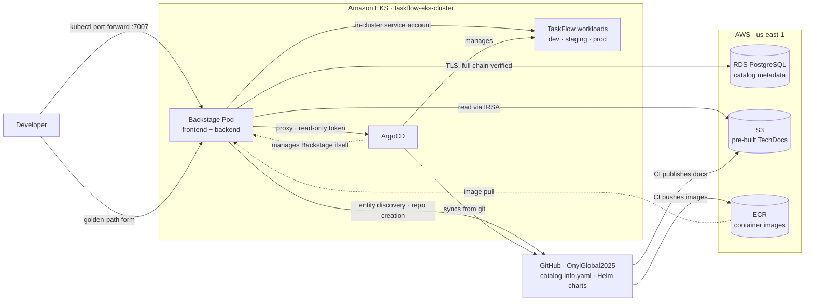

# Architecture

The TaskFlow IDP is a Backstage application deployed to Amazon EKS and delivered by ArgoCD.
It is **cluster-internal**: reached over `kubectl port-forward` rather than a public
ingress, which keeps it off the public internet and avoids domain, ACM, and ExternalDNS
costs.

## Components

- **Backstage app** — a single container running the Backstage frontend and backend,
  deployed as a Kubernetes Deployment in the `backstage` namespace via a hand-written Helm
  chart at `helm/backstage/`.
- **Amazon RDS for PostgreSQL** — production-grade managed database in `us-east-1`, holding
  the catalog and Backstage's operational state. Provisioned when the in-cluster Backstage
  first needs it (Phase 3), not before, to avoid idle spend. Connections verify the full
  certificate chain against the regional RDS CA bundle, mounted from a ConfigMap.
- **Amazon S3** — stores pre-built TechDocs. CI builds documentation with `techdocs-cli`
  and publishes here; Backstage reads over IRSA and never runs a docs build itself.
- **Amazon ECR** — holds the Backstage image, tagged with commit SHAs.
- **ArgoCD** — delivers the TaskFlow workloads across three environments, and delivers
  Backstage itself from a separate `platform` AppProject.
- **GitHub (`OnyiGlobal2025`)** — source of truth for catalog entities, Helm charts, and
  documentation. Backstage discovers `catalog-info.yaml` files over HTTPS using a personal
  access token, and the golden-path template creates new repositories here.

## Request flow

## Plugin integrations

**Kubernetes plugin** — reads live workload state using an in-cluster service account, not
IRSA. Discovery works through a `backstage.io/kubernetes-id` label on the TaskFlow
Deployments and Services, matched against the corresponding annotation in each
`catalog-info.yaml`. metrics-server supplies per-pod CPU and memory.

**ArgoCD plugin** — reads sync and health state through the Backstage proxy against a
read-only ArgoCD account. The proxy target must include `/api/v1/`, since Backstage strips
the endpoint key from the incoming path. ArgoCD runs with `server.insecure` enabled so the
proxy speaks plain HTTP over the cluster network — no certificate validation is skipped
anywhere.

**TechDocs** — uses the external builder pattern: `builder: external` with
`publisher.type: awsS3`. The portal only reads. A malformed `mkdocs.yml` in any repository
therefore cannot affect portal availability.

## GitOps delivery

Backstage is managed by an ArgoCD `Application` in `taskflow-gitops`, under a `platform`
AppProject kept separate from the `taskflow` project that governs the application
workloads. The platform project permits only the `taskflow-backstage` repository, the
`backstage` namespace, and three cluster-scoped kinds — `Namespace`, `ClusterRole`, and
`ClusterRoleBinding`. The whitelist is the project's blast radius and names only what the
chart actually creates.

Sync is automated with `prune` and `selfHeal`, so a change pushed to the Helm chart reaches
the cluster with no manual command, and manual drift is reverted to match Git.

The image tag is supplied by the Application's Helm parameters rather than committed to
`values.yaml`, because hardcoding a commit SHA into a versioned file is circular —
committing the file changes the SHA.

## Why cluster-internal

Exposing Backstage publicly would require an ingress, a domain, an ACM certificate, and
ExternalDNS — all standing costs. Port-forward access gives full functionality for a single
operator at zero additional infrastructure and keeps the portal private by default. An
internal developer portal has no business on the public internet in the first place. This
mirrors the same decision made for the Chaos Mesh dashboard in the Incident Response Lab.

The Helm values carry a commented-out ingress block, so adding public access later is a
configuration change rather than a rebuild.

## Deployment boundaries

| Concern | Decision |
|---|---|
| Exposure | Cluster-internal, port-forward only |
| TLS / domain | None (no ACM, no ExternalDNS) |
| Database | Amazon RDS PostgreSQL 16, private subnet, not publicly accessible |
| Database TLS | Full chain verification against the regional RDS CA bundle |
| Docs storage | Amazon S3, read via IRSA |
| Image tags | Commit SHA, guarded by a clean-tree check |
| Delivery | ArgoCD, `platform` AppProject, automated sync with prune and selfHeal |
| CI authentication | GitHub Actions OIDC federation — no long-lived AWS keys |
| Region | `us-east-1` |
| Account | `713923090919` |

## What does not survive a teardown

The cluster is destroyed at the end of every session. Several objects live only in the
destroyed cluster's etcd or in resources Terraform recreates empty:

- The ArgoCD API token — tokens are cluster-scoped, so a token from a previous cluster is
  worthless against a new one
- The `backstage-secrets` Kubernetes Secret and the `rds-ca-bundle` ConfigMap
- TaskFlow container images, because the `taskflow` ECR repository carries
  `force_delete = true`
- Published TechDocs, because the S3 bucket carries `force_destroy = true`

The full session-start sequence is documented as Issue 42 in `Troubleshooting-LOG.md`.