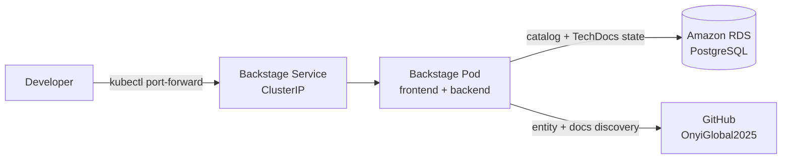

# Architecture

The TaskFlow IDP is a Backstage application deployed to Amazon EKS. It is **cluster-internal**: reached over `kubectl port-forward` rather than a public ingress, which keeps it off the public internet and avoids domain, ACM, and ExternalDNS costs.

## Components

- **Backstage app** — a single container running the Backstage frontend and backend, deployed as a Kubernetes Deployment in the `backstage` namespace.
- **Amazon RDS for PostgreSQL** — production-grade managed database in `us-east-1`, holding the catalog, TechDocs metadata, and Backstage's operational state. Provisioned when the in-cluster Backstage first needs it (Phase 3), not before, to avoid idle spend.
- **GitHub (`OnyiGlobal2025`)** — source of truth for catalog entities and TechDocs. Backstage discovers `catalog-info.yaml` files and builds docs from each repo's `mkdocs.yml`.

## Request flow

## Why cluster-internal

Exposing Backstage publicly would require an ingress, a domain, an ACM certificate, and ExternalDNS — all standing costs. Port-forward access gives full functionality for a single operator at zero additional infrastructure and keeps the portal private by default. This mirrors the same decision made for the Chaos Mesh dashboard in the Incident Response Lab.

## Deployment boundaries

| Concern | Decision |
|---------|----------|
| Exposure | Cluster-internal, port-forward only |
| TLS / domain | None (no ACM, no ExternalDNS) |
| Database | Amazon RDS PostgreSQL, provisioned in Phase 3 |
| Region | `us-east-1` |
| Account | `713923090919` |